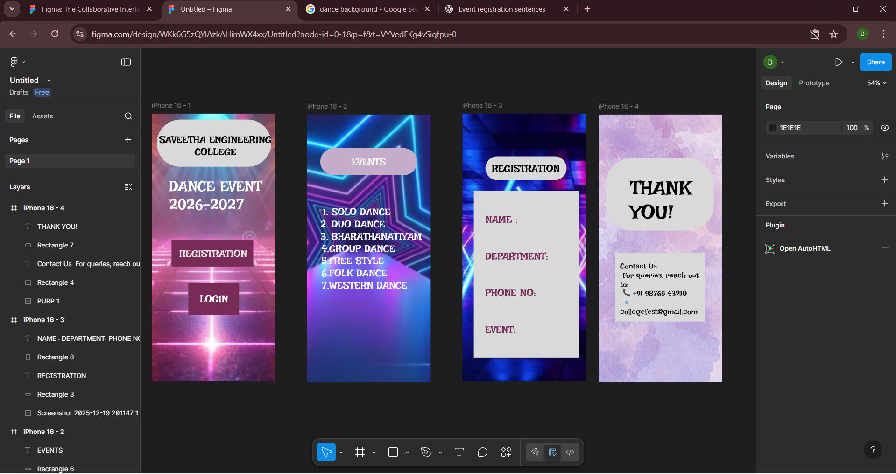

# Ex09 Event Registration Web Application
# Date:19.12.2025
# AIM:
To design, develop and deploy a web application for event registration.

# DESIGN STEPS:
## Step 1:
Create a new frame.

## Step 2:
Select any one preset size of your choice.

## Step 3:
Select the shapes you need.

## Step 4:
Import images as needed.

## Step 5:
Create pages based on your need and link them.

## Step 6:
Validate the HTML and CSS code.

## Step 6:
Publish the website in the given URL.

# DESIGN TOOL:
Figma

# CODE:
```
<div class="i-phone-16-1">
  <div class="screenshot-2025-12-19-201248-1"></div>
  
  <div class="dance-event-2026-2027">DANCE EVENT 2026-2027</div>
  <div class="rectangle-1"></div>
  <div class="registration">REGISTRATION</div>
  
  <div class="login">LOGIN</div>
  <div class="saveetha-engineering-college">SAVEETHA ENGINEERING COLLEGE</div>
  <div class="rectangle-5"></div>
  <div class="saveetha-engineering-college2">
    SAVEETHA ENGINEERING
    <br />
    COLLEGE
  </div>
</div>
```
```
<div class="i-phone-16-2">
  
  <div class="solo-dance-duo-dance-bharathanatiyam">
    <ol class="solo-dance-duo-dance-bharathanatiyam-span">
      <li>SOLO DANCE</li>
      <li>DUO DANCE</li>
      <li>BHARATHANATIYAM</li>
    </ol>
  </div>
  <div class="_4-group-dance-5-free-style-6-folk-dance-7-western-dance">
    4.GROUP DANCE
    <br />
    5.FREE STYLE
    <br />
    6.FOLK DANCE
    <br />
    7.WESTERN DANCE
  </div>
  <div class="rectangle-6"></div>
  <div class="events">EVENTS</div>
</div>
```
```
<div class="i-phone-16-3">
  
  <div class="rectangle-3"></div>
  <div class="registration">REGISTRATION</div>
  <div class="rectangle-8"></div>
  <div class="name-department-phone-no-event">
    NAME :
    <br />
    <br />
    <br />
    DEPARTMENT:
    <br />
    <br />
    <br />
    PHONE NO:
    <br />
    <br />
    <br />
    EVENT:
  </div>
</div>
```
```
<div class="i-phone-16-4">
  
  <div class="rectangle-4"></div>
  <div
    class="contact-us-for-queries-reach-out-to-91-98765-43210-collegefest-gmail-com"
  >
    Contact Us
    <br />
    For queries, reach out to:
    <br />
    📞 +91 98765 43210
    <br />
    📧 collegefest@gmail.com
  </div>
  <div class="rectangle-7"></div>
  <div class="thank-you">THANK YOU!</div>
</div>
```

# OUTPUT:


# RESULT:
The program to design, develop and deploy a web application for event registration is completed successfully.
